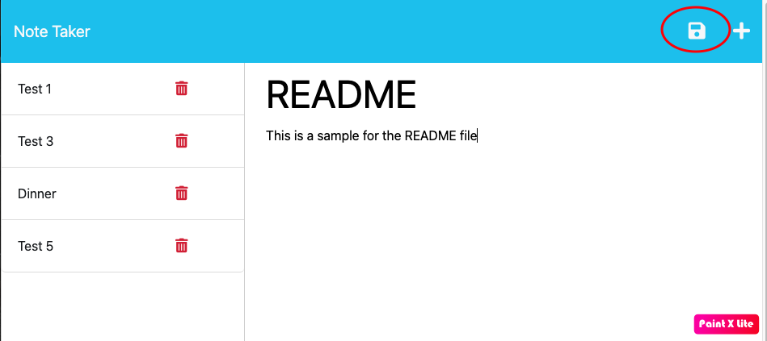

# Express Note Taker
[](https://opensource.org/licenses/MIT)

## Project Description
Create an application called Note Taker that can be used to write and save notes.

## Table of Contents
- [Installation](#installation)
- [Usage](#usage)
- [License](#license)
- [Contributing](#contributing)
- [Questions](#questions)
- [Screenshots](#screenshots)
  
## Installation
To install necessary dependencies, run the following command:
```
npm i
```

  
## Usage
The application will stroe any notes you input with it's title and text. The text can handle several lines that can be a list or actions. To make the application work, follow these steps:
    * The home page describes the functionality of the app is a breif sentence "Take notes with Express".
    * Once the user clicks on the "Get Started" button, the app takes you to the notes section. Here, the user will find a place holder for both the Note's Title and the Text, as well as any other note that has been inputed.
    * To input a new note, simply git the note a title and write the text. If the text requeires more than one line, simply press the enter key to add breaks and new lines. Once the note has a title and the whole text, click on the "save" icon on the top right corner. This will save the note on the left column.
    * If the user would like to access any of the old notes, simply click on the note's title that are listed on the left side of the screen and the note will appear on the right side with the title and the text. Please be aware that this note cannot be modified.
    * Once you have read the old note the user chose to see, if you'd like to input a new note, siply click on the plsu icon on the top right corner and the placeholder for Title and Text will appear. Simply input the new note's title and text and, once again, click on the "save" icon to save the note on the left column.
    * If the user would like to delete an old note, simply click the red trash can icon of the note that you would like to delete.

  
## License
This project is licensed under the MIT license.


Copyright (c) 2023 Ricardo Behrens. All rights reserved.


Permission is hereby granted, free of charge, to any person obtaining a copy of this software and associated documentation files (the "Software"), to deal in the Software without restriction, including without limitation the rights to use, copy, modify, merge, publish, distribute, sublicense, and/or sell copies of the Software, and to permit persons to whom the Software is furnished to do so, subject to the following conditions:

The above copyright notice and this permission notice shall be included in all copies or substantial portions of the Software.

THE SOFTWARE IS PROVIDED "AS IS", WITHOUT WARRANTY OF ANY KIND, EXPRESS OR IMPLIED, INCLUDING BUT NOT LIMITED TO THE WARRANTIES OF MERCHANTABILITY, FITNESS FOR A PARTICULAR PURPOSE AND NONINFRINGEMENT. IN NO EVENT SHALL THE AUTHORS OR COPYRIGHT HOLDERS BE LIABLE FOR ANY CLAIM, DAMAGES OR OTHER LIABILITY, WHETHER IN AN ACTION OF CONTRACT, TORT OR OTHERWISE, ARISING FROM, OUT OF OR IN CONNECTION WITH THE SOFTWARE OR THE USE OR OTHER DEALINGS IN THE SOFTWARE.
  
    
## Contributing
If the user would like to make any contributions to the application, please find the information on the "Questions" section of this README file.

  
## Questions
If you have any questions about the repo, open an issue or contact me directly at [behrensricardo@gmail.com](mailto:behrensricardo@gmail.com). You can find more of my work at [rickybehrens](https://github.com/rickybehrens).

## Screenshots
<!-- Add screenshots here -->





